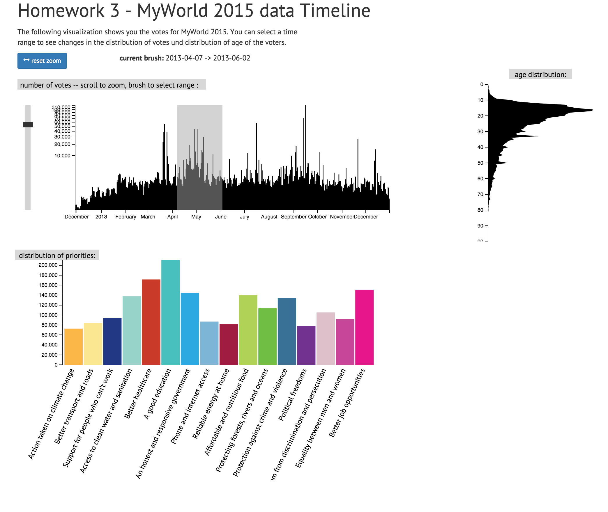
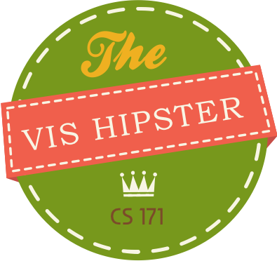

Project 3
===

In this project I will create an interactive visualization using [D3.js](http://d3js.org). While the previous project assignments were about iterating on a single visualization, the goal of this project is to connect several pieces into an interactive multiple, coordinated views (MCV) system. I will implement some of the principles introduced in the ["Interaction" lecture](http://cm.dce.harvard.edu/2015/02/24028/L08/screen_H264MultipleHighLTH-16x9.shtml). 

For this assignment I will use data from the United Nations [MY World 2015](http://www.myworld2015.org/?page=about-my-world) vote project. MY World is a global survey commissioned by the UN Millennium  Project. It aims to capture people's opinions, priorities, and views on major issues, so that global leaders can be informed as they begin the process of defining the new development agenda for the world. Individuals are asked which six of sixteen possible issues they think would make the most difference to their lives. The sixteen issues are based on the priorities expressed by poor people in previous research and polling exercises. They cover the existing Millennium Development Goals and add issues of sustainability, security, governance and transparency. 
The data is collected using the [MY World webpage](http://www.myworld2015.org/), text messages, and printed surveys. 

I will build a system that allows interactive selection of time slices of the poll data from the years 2012 and 2013. For the selected time period, the visualization will show the amount of votes per priority/choice from the poll data in addition to a histogram of participant's age for the given selection. The image below and **[this YouTube video](http://youtu.be/Hlc4bGhgbKU)** show the (interactive) final product:

    

After completing this project I will be able to:

  - Select subsets of your data via brushing.
  - Show different facets of your data with multiple linked views.
  - Create an event handler to connect interacting parts of your project.
  - Integrate zooming into your visualizations (extra credit only).
  

-- 

	
	<b>Once I completed all this, my new Expert Level is: </b>
     

